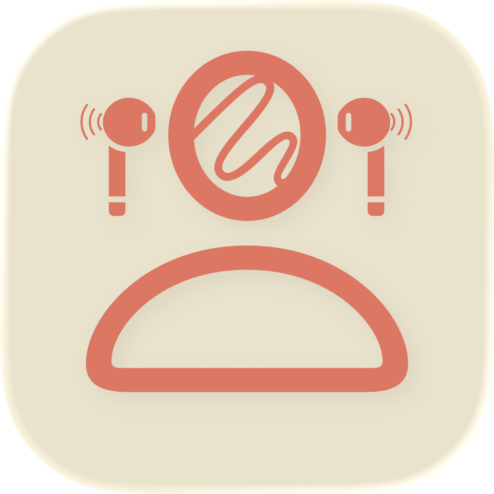

# HeadDraw

HeadDraw is a playful, hands-free drawing app for iPhone, iPad, and Mac. Steer the pencil with head movement from compatible headphones, and use your eyes to put the ink down or lift the pen.

---

## Screenshots

More can be found in screenshot folder
---

## Features

- **Head-controlled drawing:** Move your head to steer the on-screen cursor using headphone motion sensors.
- **Blink-to-lift controls:** Draw with both eyes open; close your eyes to finish the current stroke.
- **Free mode:** Draw without a prompt or timer, and double-tap the canvas when finished.
- **Game mode:** Draw a cat before the 15-second timer runs out.
- **Calibration:** Choose a drawing mode, connect supported headphones, center your head, and test blink detection before drawing.
- **Drawing gallery:** Save, browse, and revisit drawings stored on your device.
- **Export:** Share saved drawing images together in a ZIP archive.
- **Light and dark appearance:** Switch the app's appearance in Settings.

Compatible head-tracking devices listed in the app: AirPods Pro, AirPods Max, AirPods (3rd generation and later), Beats Fit Pro, and Beats Studio Pro.

---

## Architecture & Tech Stack

The iOS and macOS apps share their SwiftUI views, models, and services in `Shared/`. Observable app state is managed by `HomeViewModel`; drawings are persisted locally with SwiftData.

- **UI:** SwiftUI
- **Drawing:** PencilKit
- **Head tracking:** CoreMotion and `CMHeadphoneMotionManager`
- **Blink detection:** AVFoundation camera capture and Vision face landmarks
- **Persistence:** SwiftData
- **Targets:** iOS/iPadOS and macOS

The Xcode project has no external package dependencies.

---

## Requirements & Installation

### Requirements

- macOS 26.5 or later to run the Mac app
- iOS/iPadOS 26.5 or later to run the mobile app
- Xcode 26.5 or later
- A camera and compatible headphones for the complete drawing experience

HeadDraw requests camera access for blink detection and motion access for headphone-based head tracking. Compatible headphones are needed for head-controlled drawing; the camera is needed for blink controls.

### Run from Xcode

1. Open `HeadDraw.xcodeproj` in Xcode.
2. Select the `HeadDraw-iOS` app target for iPhone or iPad, or `HeadDraw-Mac` for macOS.
3. Choose a compatible simulator or connected device and run the app with **Product > Run** (`⌘R`).
4. Grant camera and motion permissions when prompted, and connect a supported headphone model to use head tracking.
